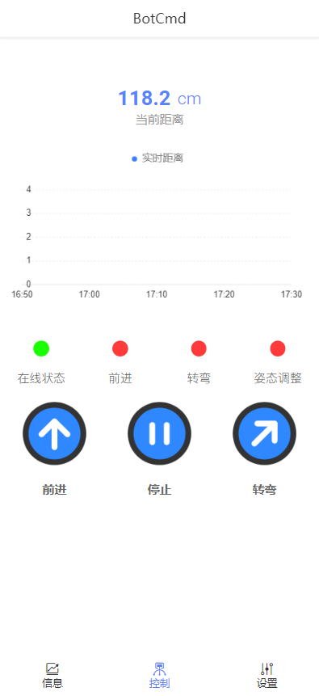

<div align=center>  </div>

# <p align="center">Simple-Quadruped-Robot</p>

<p align="center">
  
  
  
</p>

<p align="center" style="font-size: 24px; font-weight: bold;">🎉一个基于NodeMCU-32S + 阿里HaaS物联网开发框架的四足爬行机器人🎉</p>

## 一、项目介绍

&emsp;&emsp;该四足爬行机器人共有8自由度，基于NodeMCU32开发板为主控，使用MicroPtyhon语言编写控制程序，使用PCA9685模块控制8路舵机以控制机器人的运动， 机器人采用运动学正解的方法，使用蠕动步态进行运动，并使用阿里物联网平台进行控制以及参数展示。

&emsp;&emsp;仓库内包含了Webots软件的步态仿真工程文件以及使用HaasOS Python的工程文件。具体内容如下：

<div align="center">
  <table>
    <thead>
      <tr>
        <th style="text-align: left;">文件名</th>
        <th style="text-align: left;">说明</th>
      </tr>
    </thead>
    <tbody>
      <tr>
        <td style="text-align: left;">Wbt_project</td>
        <td style="text-align: left;">WeBots步态仿真工程</td>
      </tr>
      <tr>
        <td style="text-align: left;">releases_code</td>
        <td style="text-align: left;">HaaS工程源码</td>
      </tr>
    </tbody>
  </table>
</div>

&emsp;&emsp;3D模型文件以及相关工作文件存放至仓库[Simple-Quadruped-Robot_Models](https://github.com/jmzdd/Simple-Quadruped-Robot_Models)

## 二、硬件介绍

### 2.1 硬件主控

&emsp;&emsp;在硬件上选择阿里云官方已适配的NodeMCU-32S开发板作为主控板，是基于乐鑫ESP32芯片的开发板。ESP32 是集成2.4 GHz Wi-Fi 和蓝牙双模的单芯片方案，具有超高的射频性能、稳定性、通用性和可靠性，以及超低的功耗，满足不同的功耗需求，适用于各种应用场景。

<div align=center> </div>
<p align="center">主板配置</p>

&emsp;&emsp;作为整个机器人的“大脑”，除了GPIO34、35、36、39只能作为输入外，其他的GPIO都可以支持PWM输出，多数GPIO还复用了其他功能，比如：IIC、ADC、SPI、UART、DAC等功能。

<div align=center> </div>
<p align="center">拓展接口</p>

### 2.2 云平台与编程语言

&emsp;&emsp;HaaS的全称为“Hardware as a Service”意为硬件即服务，是阿里推出的物联网设备云端一体开发框架。而HaaS Python是阿里云IoT HaaS团队针对物联网领域推出的低代码云端一体开发框架的重要组成部分，它真正做到了“Python也可以轻松开发智能硬件”。

&emsp;&emsp;通过预置的API调用，Python应用快速移植的硬件访问接口Driver库及包括Socket，HTTP，HTTPS，Websocket，MQTT及aliyunIoT（连接阿里云物联网平台的SDK）在内的多种网络功能。

## 三、系统设计

### 3.1 系统概述

&emsp;&emsp;阿里云物联网平台是一个集成了设备管理、数据安全通信和消息订阅等能力的一体化平台。向下支持连接海量设备，采集设备数据上云；向上提供云端API，服务端可通过调用云端API将指令下发至设备端，实现远程控制。依托阿里物联网平台，可以实现本地产品的快速上云。

<div align=center> </div>
<p align="center">平台工作原理</p>

&emsp;&emsp;在开发板烧入HaaS提供的固件，联网后通过MQTT与物联网平台进行通信。使用HaaS提供的API编写程序代码，烧入后即可实现云端控制，并将数据反馈在云平台上，实现低成本且高效的快速上云。

### 3.2 系统组成

&emsp;&emsp;系统整体可大体拆分至硬件和软件两大部分。

<div align=center> </div>
<p align="center">系统结构</p>

&emsp;&emsp;硬件部分由NodeMCU32开发板作为主控、控制PCA9685以同时调动8个SG90舵机进行运动。在运动的基础上添加超声波模块以实现避障功能，并通过北斗定位模块上传位置信息。最后在云平台上设计好控制端，以实现云端控制。

&emsp;&emsp;软件上依靠HaaS提供的API，使用Python编写代码。通过软件控制多个模块的工作与数据上传。除了模块驱动程序，其需要解决的主要问题有：程序的多线程调配，设备属性的实时更新与上报，机器人的运动算法调整等。

## 四、硬件设计

### 4.1 锂电池充放电管理模块

&emsp;&emsp;由于机器人的容量和开发板的外形限制，为了更加贴合机器人的“模块化”设计理念，因此摒弃了直接购买而选择重新设计一块可直接装配在机器人内部的锂电池充放电模块。根据开发板数据手册，在设计上模块的供电范围在4.75~5.25V，供电电流>500mA。在设计思路上将充电放电两个功能分开处理，使用了TP4056以及MC34063这两款芯片以实现功能，这两款芯片应用方案成熟且功能上实现难度相对简单，拥有设计简单、外围器件少、开发成本低等优点。

<div align=center> </div>
<p align="center">锂电池充放电管理模块原理图</p>

&emsp;&emsp;作为主电源的18650提供稳定的3.6V电压，TP4056是专门为一节锂离子电池或锂聚合物电池而设计的线性充电器。针对电池充放电有单独的充电、结束指示灯控制信号。芯片集成功率晶体管，充电电流可以用外部电阻设定，持续充电电流可达1A，不需要加阻流二极管和电流检测电阻，本模块设计的充电电流为1A，默认没有添加温度检测电阻。当接入电源对电池进行充电时，充电指示灯（红）长亮，电池进入充电状态。当电池电压达到4.8V左右时，TP4056将点亮充电指示灯（绿），显示电池已经充满。

<div align=center> </div>
<p align="center">实物图</p>

&emsp;&emsp;供电部分由MC34063负责电池电压升压，模块单独设计开关，将电池的充/放电功能区分开。当开关开启后，蓝灯常亮显示电池开始进入工作状态为开发板和模块供电。电池电压进入MC34063芯片6脚电源输入端，当芯片内开关管(T1)导通时，电源经取样电阻Rsc、电感L1、MC34063的1脚和2脚接地，此时电感L1开始存储能量，而由C0对负载提供能量。当T1断开时，电源和电感同时给负载和电容Co提供能量。电感在释放能量期间，由于其两端的电动势极性与电源极性相同，相当于两个电源串联，因而负载上得到的电压高于电源电压。开关管导通与关断的频率称为芯片的工作频率。只要此频率相对负载的时间常数足够高，负载上便可获得连续的直流电压，为模块和开发板提供稳定的5V电压。

<div align=center> </div>
<p align="center">充电状态</p>

### 4.2 机械部分

&emsp;&emsp;一般情况下, 腿部机构的杆件数量要适中, 不宜过多, 杆件过多会造成腿部机构形式过于复杂, 导致结构和传动实现困难。腿部机构的设计一般需要满足几个条件:满足运动要求, 运动轨迹符合设计需要;腿部机构具备相应的负载能力，控制系统简单, 操作容易。

&emsp;&emsp;因此，机器人在整体造型上在Workshop Q1 mini的基础上进行修改，而打印材料则选择了常见的PLA耗材，用Prusa i3 DIY 3D打印机进行打印。使用开源建模软件Blender对原模型进行了调整与改进。

<div align=center> </div>
<p align="center">打印模型</p>

&emsp;&emsp;在模型上，针对原模型的脚部触地面积过小容易打滑的问题，对机器人的脚进行了重新设计，并增加了防滑垫以增加与地面的摩擦力。并在脚部添加一个由螺丝锁紧的可调节关节用以手动调平，以方便调节机器人的姿态并弥补由于3D打印机的精度不足而带来的运动平衡问题。

<div align=center> </div>
<p align="center">使用Blender建模</p>

## 五、软件设计

### 5.1 运动学分析

&emsp;&emsp;机器人的每一步运动都是相对的，想要使机器人移动，就必须需要让每一只脚都有规律的运动。在思路上，将整个机器人的身体看作整体，每一只脚都要按照一定的规律向前移动，每次运动都要让身体向前移动一定的距离，经过一个周期后即可实现机器人的整体前进。

&emsp;&emsp;权衡了各个运动模拟软件的优劣之后，最终选择了使用Webots软件作为最终的模拟软件。Webots是一款开源的多平台机器人仿真软件，为机器人的建模、编程和仿真提供了完整的开发环境。且支持C语言开发，调用文档给出的API即可编写机器人的各项动作细节，以及获取各项模拟参数。在经过了简单的模拟验证后，最终证明了“Creep Gait”是可行的。

<div align=center> </div>
<p align="center">使用Webots模拟</p>

<div align=center> </div>
<p align="center">实时模拟画面</p>

### 5.2 步态分析

&emsp;&emsp;在参考多份资料后，最终选定了使用“Creep Gait”（蠕变步态）作为四足机器人使用的主要运动步态。在研究机器人运动步态之前，我们要先了解四足机器人在运动过程当中的运动特点。

&emsp;&emsp;四足机器人在运动时，实际上是以“小跑”的形式在运动，因为四足的特性意味着四只脚需要交替运动，在运动过程中需要保持至少有3只脚是与地面接触以让身体保持平衡，因此需要四条腿不停的交替变换以达到平衡的目的。

<div align=center> </div>
<p align="center">机器人重心示意图</p>

&emsp;&emsp;当机器人的三只腿在同一平面上且中心在三角形内部，则机器人即可保持姿态平衡。反之，则机器人的重心不稳，进而会导致机器人失衡。在了解大致的原理后，即可按照规定好的步态规则编写控制代码。

<div align=center> </div>
<p align="center">步态分解</p>

### 5.3 程序实现

&emsp;&emsp;按照其运动规律，使用Python编写程序。使用由HaaS官方提供的驱动以及API，我们就可以编写一段控制舵机的程序。代码遵循蠕变步态，针对每个舵机的动作进行单独设置，并在步态的基础上对其进行微调，以达到最终的运动效果。其相关代码如下所示：

```
run_on_list = [[8,0.2], [10,1.3], [14,-1], [12,0.5], [14,0.5], [8,1], [10,1], [14,1], [6,-0.5], [4,0.8], [2,0.8], [2,-0.8], [2,1], [0,0], [2,-1.5], [6,1.6], [4,0], [6,0.3], [10,-1], [10, 0.5], [12,1.3], [14,1.3], [6, -0.3], [0,1], [2,-1]]
def run_on():
    global par
    utd.utd_fuc()
    if utd.distance <= 65:
        run_turn()
        par = 0
    robot.setServo(run_on_list[par][0],run_on_list[par][1])
    sleep(delay)
    if par == len(run_on_list)-1:
        par = 0
    else:
        par = par + 1
```

&emsp;&emsp;而机器人的控制端，则是直接使用阿里云物联网平台IoT Studio的“应用开发”开发移动端小程序进行控制。通过在本地设置设备属性，在移动端上为按钮配置触发事件，以控制联网后的NodeMCU32。当按下按钮时，阿里云向已联网的开发板下发指令，示意将“前进”这一设备属性设置为True，程序中当控制舵机的函数获得True的返回值后，即马上执行前进的指令，使机器人向前行进。由于联网延时以及移动端按钮只支持点按触发，因此机器人在行进一段距离后会自动停止。

&emsp;&emsp;除此之外，移动端还提供了距离检测数据以及机器人运动状态检测指示灯，用于操作时对机器人的实时监控。而Web操作大屏则能够放在Web端进行展示，能够更加直观的体现机器人的当前状态。

<div align=center> </div>
<p align="center">移动控制端</p>

## 六、系统调试与分析

### 6.1 实物展示以及操作方法

&emsp;&emsp;成品如图所示：

<div align=center> </div>
<p align="center">成品实物图</p>

&emsp;&emsp;当开发板接上电源后，即可通过蓝牙配网的方式，通过手机控制端传输相关的WiFi名和密码即可连接WiFi网络。连接网络后，控制端的上线指示灯点亮。当按下前进按钮后，前进指示灯点亮，同时超声波模块开始工作并向云端不间断传输数据。按下停止按钮即可实现停止运行，此时机器人停止动作，并点亮控制端上的停止指示灯。

&emsp;&emsp;同时程序设定，当超声波检测的距离小于等于75时，系统自动打断前进模式，并进入循环转弯，直到距离达到安全距离，即退出转弯，回到原来的直行模式。

### 6.2 硬件调试与检查

&emsp;&emsp;将电路板焊接完成后，除MC34063芯片工作正常外，模块的充电功能未能成功实现。升压工作芯片的工作电压为0.4V，芯片发热且电感啸叫。在将二极管调转方向后电压为3.3V，芯片发热但电感不啸叫。在加上330µF电容后5V能够正常输出，芯片不发热，但是输出电流仅有0.05µA，电感仍啸叫。充电时指示灯没有按照预期点亮，切换成供电模式时电压不够。在更换芯片后，红绿灯同时亮且无电压输出，R3电阻值过小需要调大。

&emsp;&emsp;由于线性IC原理决定了TP4056芯片工作时的发热问题，因此需要在焊盘上增加导通孔以帮助散热，此外还需要采用限流等方式以减轻芯片的工作负荷。由于在绘制原理图的过程中缺失了一颗电感和一颗电容，因此在工作时电池放电电压低于正常工作电压，以及电感数值小导致工作期间电感啸叫等问题。

### 6.3 软件调试与检查

&emsp;&emsp;上云部分通过HaaS提供的API，在代码中填入由阿里云物联网平台的“三元组”，通过开发板连接并上传进行身份验证，连接成功后阿里云平台显示设备上线。在本地编写好各个模块的控制代码后，在云平台创建设备属性，并设置其返回的数据类型，随后嵌入到对应的模块代码当中。通过由阿里预留的API函数，即可实现在设备运行时，监控由云端下发的属性指令。

&emsp;&emsp;在获得指令后，即可在代码中执行逻辑，并让设备反馈相应的动作。在动作完成的同时，将设备的属性上传至云端。通过事先已经设计好的组态，即可呈现此时的设备实时状态。至此完成了由本地到云端连接并通信的所有操作。

&emsp;&emsp;本地程序的编写采用MicroPython，不同于传统C语言，在实现需要循环的任务时，则需要使用多线程，启用多个任务的同时可实现设备不进入死循环而无法跳出。

## 七、项目总结

&emsp;&emsp;本项目设计四足爬行机器人涉及机器人学、仿生学应用、运动学、单片机应用等学科知识，在硬件设计和软件实现上花费了比较长的时间。机器人是使用了阿里的物联网平台，基于Ali Things开发，实现设备的快速上云。它仅用一块esp32开发板和几个模块就可以实现云端控制的效果。

&emsp;&emsp;简单快速的开发在现实生产中也具有很大的经济效益，无论是管理难度上，还是开发周期上，都极大的减少了产品产出的难度。相比于传统的嵌入式开发设计，则节省了更多的人力物力。在硬件结构上，该机器人采用了模块化的设计，方便使用者调试和更换器件，使整体结构更加的简单。所有的元器件大部分选择贴片器件以高度集成。

&emsp;&emsp;当然了，即使几乎考虑到了所有情况，设计仍然存在着一些不足。例如机器人的步态受制于我的编程水平，在软件算法上依旧有很大的改进空间。硬件上由于没有完全掌握Blender建模，建立的模型精度依然有缺陷。


## 参考资料
[How to Program a Quadruped Robot with Arduino - Make: (makezine.com)](https://makezine.com/article/technology/robotics/robot-quadruped-arduino-program/)

## 感谢
[yanhy2000](https://github.com/yanhy2000)对代码中多任务处理部分提供的帮助(release_code.zip/release/src/lib_thread.py)
